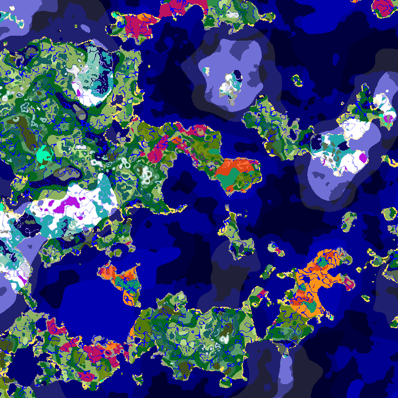

# WorldGeneratorApi

Nowadays, you have many options to edit how your world generates. Bukkit got a hugely expanded world generation API in 2021, and data packs are able to take control over almost any aspect of world generation. But, how would you generate a map like this?

The answer: first, install a data pack that increases ocean size, then install WorldGeneratorApi, then run `/worldgeneratorapi biomemap`.

WorldGeneratorApi is a modest API, adding some functionality for world generation. It used to be bigger, but most code has been dropped in favor of the new methods in the Bukkit API.

* Ability to create biome maps of your world
* Ability to modify the vanilla biome generator using code
* Ability to view (and use) noise values for your terrain - temperature, humidity, weirdness, continentalness, erosion, factor, offset and jaggedness.

Please head to [the wiki](https://github.com/rutgerkok/WorldGeneratorApi/wiki) to learn more.

## License
License is [MIT](LICENSE), so you can freely use this API, even in premium plugins. Just put up a note that you're using WorldGeneratorApi.

## Compiling
We use Maven. Maven can be a bit tricky to install (you need to modify the environment variables of your computer), but once you have managed to do that, just run:

    mvn install

You'll end up with a file `./target/WorldGeneratorApi-1.0.jar` (version number will be different of course), which is a ready-to-use plugin. There's also the file `./worldgeneratorapi/target/worldgeneratorapi-1.0.jar`, which is just the API. This file can be used by plugin developers to code against: it will not run on the server, as it is missing the implementation.

## Bug reports, feature requests and pull requests
Contributions are always welcome! Just open an issue or pull request. 
